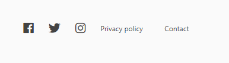

# Dashboard
## Overview

The dashboard is the landing page for each user.  
On this page you will find a overview of all projects that you are currently participating in.
Only *Active* participations are show.  
An inactive participation is when either the user has stopped participating in a project, the project is closed or the project has reached its enddate.

## Firsttime / No active participations
When there are no active participations present, the user will be shown a alternate dashboard page.

The user can use either the big button in the middle or the button in the title bar to sign up for a project.

## Register for a project
Each time the user signs-up for a project, he  wil be first prompted to confirm his profile date.  

After filling in the required fields the user will be prompted to select one or more projects he wants to participate in.

## Using the projectcard
Each project is represented by a card.  
Each card offers four options.  

- Details: Go to the details page of a project.
- Beschikbaarheid: Go to a page where you can register your availabilities.
- Mijn Shifts: See when you are scheduled to work.
- Uitschrijven: Stop participating in a project.*

*It is not possible to stop participating when you are scheduled for shifts in the future.

  
Using the links in the footer, the user is able to navigate to various pages including the social media platforms *Hartige Samaritaan* uses. 
